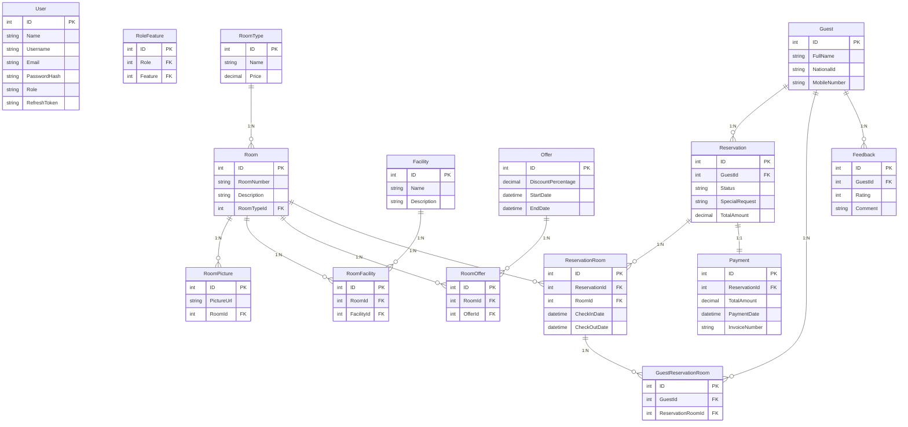
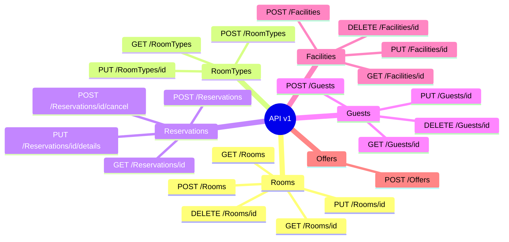

# 🏨 Hotel Reservation System Web API

<div align="center">


**A highly maintainable, scalable, and testable Hotel Reservation API built on Onion Architecture and CQRS**

[Features](#-highlighted-features) • [Architecture & ADRs](#-architecture-decision-records-adrs) • [Database](#️-database) • [Testing](#-unit-testing) • [Getting Started](#-getting-started)

</div>

---

## 📖 Overview
Hotel Reservation System is a backend API built to manage the core operations of a hotel, including room availability, guest reservations, pricing and special offers, and facility management. The project is designed with Onion Architecture and CQRS using MediatR to keep the codebase clean, maintainable, and easy to scale. It provides a solid foundation for building real-world hospitality systems with clear separation between business logic, application flow, and infrastructure concerns.

---

## ✨ Highlighted Features

- **🧅 Onion Architecture**: Strict separation of concerns keeping the Domain layer independent of UI and Infrastructure.
- **🔄 CQRS Pattern (MediatR)**: Command Query Responsibility Segregation to separate read and write operations, making the application highly scalable and avoiding "Fat Services".
- **🛡️ Custom Middlewares**:
  - `GlobalErrorHandlerMiddleware`: Centralized exception handling to ensure consistent API responses without scattering `try-catch` blocks everywhere.
  - `TransactionMiddleware`: Automatically manages database transactions per request to ensure data integrity across complex orchestrators.
- **🚦 Custom Action Filters**:
  - `CustomAuthorizeFilter`: Fine-grained role and permission-based authorization.
- **🗄️ Repository Pattern**: Implementing `GenericRepository` alongside specific repositories (like `RoomRepository`) to decouple data access logic.
- **🔐 Security**: JWT-based Authentication and Authorization with Refresh Tokens.
- **🗺️ Object Mapping**: Using `AutoMapper` to map between Domain Entities and DTOs/ViewModels smoothly.
- **🔍 Advanced Queries**: Pagination, Filtering, and Orchestrator-driven complex flows (e.g., `AddRoomOrchestrator`, `UpdateReservationOrchestrator`).
- **⚡ In-Memory Caching**: Implemented for frequently accessed data like `RoleFeature` authorization to reduce database load.
- **🚀 Distributed Caching (Redis)** *(in progress)*.
- **🧪 Comprehensive Unit Testing**: Over 80+ tests validating orchestrators and handlers.

---

## 🏗️ Architecture

```
┌─────────────────────────────────────────────┐
│       HotelReservationSystem.API            │  ← Presentation Layer
│    Controllers · Middlewares · Filters      │
└─────────────────┬───────────────────────────┘
                  │
┌─────────────────▼───────────────────────────┐
│                 Application                 │  ← Business Logic Layer (CQRS)
│   Handlers · DTOs · Mappers · Orchestrators │
└─────────────────┬───────────────────────────┘
                  │
┌─────────────────▼───────────────────────────┐
│                Infrastructure               │  ← Data Access Layer
│     DbContext · Repositories · Migrations   │
└─────────────────┬───────────────────────────┘
                  │
┌─────────────────▼───────────────────────────┐
│                   Domain                    │  ← Core Domain Layer
│          Entities · Enums · Interfaces      │
│          (zero external dependencies)       │
└─────────────────────────────────────────────┘
```

## 🏗️ Architecture Decision Records (ADRs)

> *"Programming is no longer just code that runs.. Programming has become documenting your thinking and architecture for your decisions."*

Here are the key architectural questions and decisions made during the design phase:

### 1. Why Onion Architecture over Traditional N-Tier?
- **Decision:** Use Onion Architecture.
- **Trade-offs:** N-Tier is easier to set up initially and familiar to beginners. However, it often leads to tight coupling with data access frameworks. Onion architecture requires more initial boilerplate and interfaces.
- **Advantages:** The Domain layer (business logic) is completely isolated at the center. We can swap out the database (Infrastructure) or the UI (API) without touching the core business rules. 
- **Disadvantages:** Higher learning curve and more files/folders to manage.

### 2. Why CQRS Pattern with MediatR (The Orchestrator)?
- **Decision:** Implement Command Query Responsibility Segregation (CQRS) using the MediatR library. *Note: CQRS is a Design Pattern, not an architecture.*
- **The "Fat Service" Problem:** In traditional architectures, mixing Read and Write operations in a single `UserService` or `ReservationService` leads to bloated classes. It forces us to inject multiple contexts and repositories into one place.
- **Advantage 1: Resolving Coupling & Cyclic Dependencies:** If a controller only needs one specific action, injecting an entire "Fat Service" (which might internally depend on 15 other services) creates high coupling and potential cycle dependencies. MediatR acts as an **orchestrator**, ensuring that we only inject and trigger the exact handler needed for that specific action.
- **Advantage 2: Data Source Separation:** CQRS allows us to separate read and write loads. We can use a lightweight SQL Server for writes, and a highly optimized database for reads.
- **Trade-offs / Disadvantages:** CQRS and MediatR introduce a significant amount of boilerplate code (Commands/Queries, Handlers, Validators).

### 3. Why Custom Middlewares for Error Handling and Transactions?
- **Decision:** Use `GlobalErrorHandlerMiddleware` and `TransactionMiddleware`.
- **Trade-offs:** Developers could just use `try/catch` and `transaction.Commit()` in every MediatR handler or Controller.
- **Advantages:** Keeps the business logic extremely clean. If a command succeeds, the transaction commits. If it fails, it rolls back, and the error middleware catches the exception to format a standardized API error response.
- **Disadvantages:** Hides control flow slightly; new developers need to understand the middleware pipeline.

### 4. Future Development & Evolution (What's Next?)
- **Caching Layer:** Implemented In-Memory caching for `RoleFeature` to optimize authorization checks. Integrating Redis to cache frequent queries (like available rooms) to reduce database load *(in progress)*.
- **Validation Pipeline:** Implementing FluentValidation integrated with MediatR pipeline behaviors to validate commands before they even hit the handlers *(in progress)*.
- **Advanced Searching:** Implementing dynamic Expression Trees for complex filtering required by hotel search engines *(in progress)*.

---

## 🗄️ Database



---

## 🛠️ Technology Stack

| Technology | Purpose |
|------------|---------|
| **.NET 10 / ASP.NET Core** | Web API framework |
| **Entity Framework Core** | ORM + Code-First migrations |
| **SQL Server** | Primary database |
| **MediatR** | CQRS implementation (Commands/Queries orchestrator) |
| **AutoMapper** | Object-to-object mapping (Entities ↔ DTOs) |
| **IMemoryCache** | Fast local in-memory caching for role/feature permissions |
| **Redis** *(WIP)* | Distributed caching for fast lookups |
| **JWT** | Secure authentication and authorization |

---

## 📂 Project Structure

```text
HotelReservationSystemWebAPI/
│
├── 🎯 Domain                  # Core Entities, Enums, and Repository Interfaces (No Dependencies)
├── ⚙️ Application             # CQRS Handlers, DTOs, AutoMapper Profiles, Business Logic
├── 🔌 Infrastructure          # EF Core DbContext, Migrations, Repository Implementations
├── 🌐 HotelReservationSystem.API # Controllers, Middlewares, Filters, Program.cs (Presentation)
└── 🧪 Hotel.UnitTests         # CQRS Handler and Orchestrator Unit Tests
```

---

## 📚 API Documentation



---

## 🧪 Unit Testing

### 🗂️ Test Project Structure
All unit tests live in the `Hotel.UnitTests` project and follow a consistent structure aligned with **CQRS handlers and Orchestrators** in the `Application` layer.

| Tool | Role |
|---|---|
| **NUnit** | Test framework (`[TestFixture]`, `[Test]`, `[SetUp]`) |
| **Moq** | Mocking repositories, `IMediator` |
| **FluentAssertions** | Expressive, readable assertions |
| **coverlet.collector** | Code coverage data collection |
| **ReportGenerator** | HTML coverage report generation |

### ✅ Test Results Summary

```text
Passed!  - Failed: 0, Passed: 82, Skipped: 0, Total: 82
```

| Test File | Tests | Handlers Covered |
|---|---|---|
| `Facility_Test.cs` | 9 | Add, Update, Delete, GetById |
| `RoomType_Test.cs` | 8 | Add, Update, CheckExist |
| `Room_Test.cs` | 17 | Add, Update, Delete, GetRoomType, IsRoomExist, GetTotalPrice |
| `Guest_Test.cs` | 12 | Add, Update, Delete, GetGuest, IsGuestExist |
| `Offer_Test.cs` | 2 | AddOffer |
| `Reservation_Test.cs` | 9 | Cancel, UpdateDetails, GetById |
| `AddRoomOrchestrator_Test.cs` | 7 | 5-step chain + data-flow verification |
| `DeleteRoomOrchestrator_Test.cs` | 4 | 3-step chain |
| `AddOfferOrchestrator_Test.cs` | 5 | 3-step chain + data-flow verification |
| `UpdateReservationOrchestrator_Test.cs` | 6 | 3-step chain + status guards |
| **Total** | **82** | |

---

## 🚀 Getting Started

### Prerequisites
- .NET SDK (10.0 or later)
- SQL Server

### Setup

1. **Clone the repository:**
   ```bash
   git clone https://github.com/Abdelrhman-elsaeed/HotelReservationSystemWebAPI.git
   cd HotelReservationSystemWebAPI/HotelReservationSystem.API
   ```

2. **Database Configuration:**
   Update the `DefaultConnection` string in `appsettings.json` to point to your local SQL Server instance.

3. **Apply Migrations:**
   ```bash
   dotnet ef database update --project ../Infrastructure --startup-project .
   ```

4. **Run the API:**
   ```bash
   dotnet run
   ```

5. **Explore:** Open the browser and navigate to `https://localhost:<port>/swagger` to test the endpoints.

---

## 📌 Roadmap & Status

- [x] Base Onion Architecture Setup
- [x] CQRS Implementation with MediatR
- [x] JWT Authentication & Authorization
- [x] Custom Middleware (Error Handling & Transactions)
- [x] Custom Action Filters
- [x] AutoMapper Configuration
- [x] Unit Testing for all Application Logic
- [x] In-Memory Caching (RoleFeature authorization)
- [ ] Redis Distributed Caching *(in progress)*
- [ ] FluentValidation Pipeline *(in progress)*

---

<div align="center">

*This README was designed not just to explain how to run the project, but to document the engineering mindset and architectural decisions behind it.*

**⭐ Star this repository if you find it helpful!**

Made with ❤️ using .NET 10

</div>
